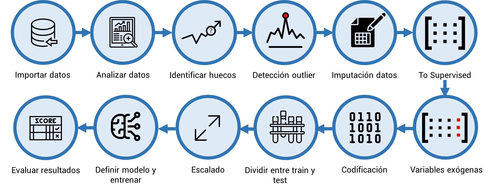

# DSIII_datathon_msa
This is the final project of the five months course 'Data Science workcamp' @Codespace.
It consists in publishing a trained time series predictive model with end-to-end real data.
The scope of the project is:
👉 Load into bbdd delivered input data from excel files.
👉 From bbdd, extract dada for working with dataframes.
👉 Analyze, clean and complete data, resample, get exogenous variables by API (meteostat).  
👉 Preprocess and transform data to adapts a time series problem to supervised learning.  
👉 Split data in train/validation/test (X & y)
👉 Create an experimet in MLflow and launch piped runs to select the besto model.
👉 Deploy the model's API (python / Docker).
👉 Get predictions for the model.
👉 Deliver to bbdd the real data and predictions for further data anaytics in Power BI.

This all following the steps have leraned as best practises.

